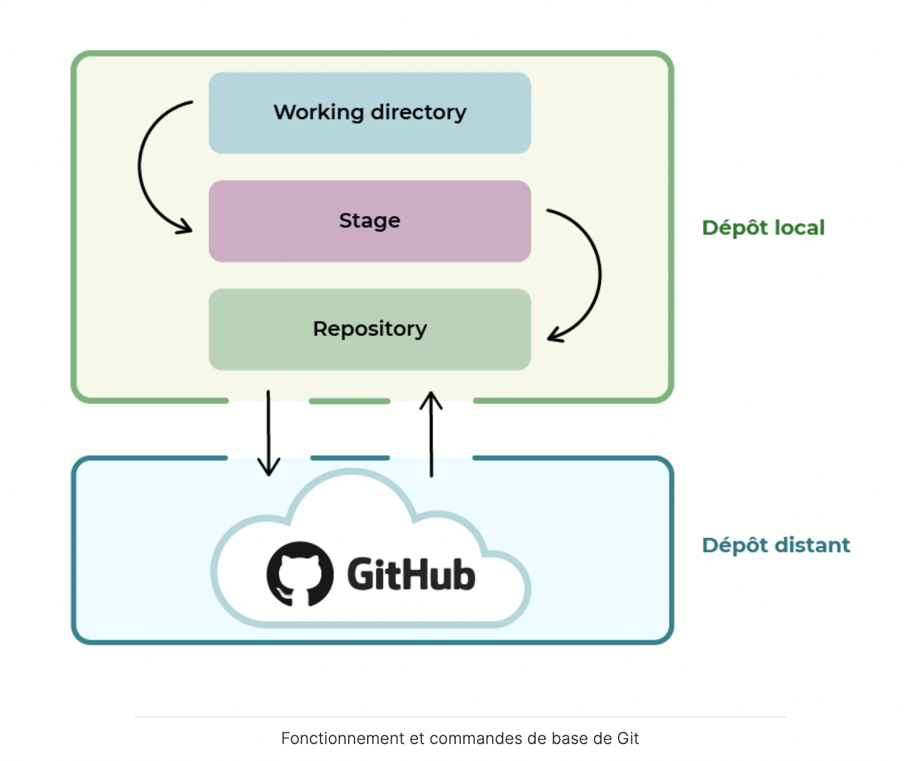
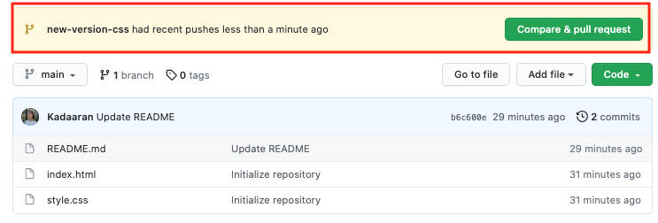

1. Git, c'est quoi ? 

- Git permet de suivre les modifications de votre code et d'organiser vos projets de développement. 
- Un gestionnaire de versions est un programme qui permet aux développeurs de conserver un historique des modifications et des versions de tous leurs fichiers. Git est le système de contrôle de versions le plus largement utilisé aujourd'hui.


2. La différence entre Git et GitHub ?

- **Git est un gestionnaire de versions**. Vous l’utiliserez pour créer un dépôt local et gérer les versions de vos fichiers.

- **GitHub est un service en ligne** qui va héberger votre dépôt. Dans ce cas, on parle de **dépôt distant** puisqu’il n’est pas stocké sur votre machine.

- Avec Git, vous préparez votre code. Avec GitHub, vous stockez votre code.


3. Dépot (repository) local et distant

   - Un dépôt est comme un dossier qui conserve un historique des versions et des modifications d’un projet. Il est essentiel pour travailler en équipe ou collaborer à un projet open source.

   - Un dépôt local est l’endroit où l’on stocke, sur sa machine, une copie d’un projet, ses différentes versions et l’historique des modifications.

   - Un dépôt distant est une version dématérialisée du dépôt local, que ce soit sur Internet ou sur un réseau. Il permet de centraliser le travail des développeurs dans un projet collectif.

   

4. Utilisation basique 

- `git add` permet d’ajouter des fichiers dans l’index, qui est une zone intermédiaire dans laquelle stocker les fichiers modifiés.
- `git commit` permet de créer une nouvelle version avec les fichiers situés dans l’index.
- `git commit -m` permet de créer une nouvelle version et de préciser le message rattaché au commit.
- `git push` permet d’envoyer les modifications faites en local vers un dépôt distant. 




5. 3 phrases de gestion de versions 

- Untracked
- Staging 
- Commit


6. Apprendre le système de branches

- Une branche est une “copie” d’un projet sur laquelle on opère des modifications de code.
- La branche main (ou anciennement master) est la branche principale d’un projet.
- git checkout permet de basculer d’une branche à une autre.
- git merge permet de fusionner deux branches.

```shell
git branch # current branch of the project / all branches avaible
git branch cagnotte # create a branch named cagnotte in local
git checkout cagnotte # change the branch from actual branch (like main) to cagnotte
git commit -m "Réalisation de la partie cagnotte côté front end" # save all changes in the cagnotte branch

# integrate the cagnotte branch to the main branch
git checkout main # switch to the branch main
git merge cagnotte # merge cagnotte branch to main 

```


7. Mettre à jour le dépôt au local

```shell
git pull origin main
```


8. Réaliser un pull request

Une **pull request**, ou *demande de pull*, en français, est une fonctionnalité de GitHub qui permet de demander aux propriétaires d’un repository l’autorisation de fusionner nos changements sur la branche principale ou toute autre branche sur laquelle on souhaite apporter nos modifications.

Donc si vous créez une pull request, vous avez au préalable :

1.  Créé une nouvelle branche.
2. Envoyé votre code sur cette même branche.

D’ailleurs, lorsque ces deux conditions sont remplies, un bandeau apparaît à l’écran pour vous suggérer de créer une pull request.



 

9. Demandez une relecture de code

Sur des projets d’envergure, il peut arriver que votre code ne puisse être fusionné sur la branche principale sans être relu et validé par d’autres membres du projet. C’est ce qu’on appelle une *Code Review*, ou *revue de code*, en français. Cela permet de prévenir les erreurs éventuelles, de discuter sur un choix, une prise de position ou même de poser des questions. 


10. Sur GitHub, nous pouvons récupérer l'URL d'un dépôt distant.
    - `git clone` permet de copier en local un dépôt distant.
    - `git remote add` permet de lier un dépôt à un "nom court", pour une plus grande facilité d’utilisation.
    - `git pull` permet de dupliquer un dépôt GitHub en local.
    - Une Pull Request permet de demander à fusionner votre code sur la branche principale.

```shell
git remote add OC https://github.com/OpenClassrooms-Student-Center/7162856-G-rez-Git-et-GitHub.git
# OC représente le nom court que vous utiliserez ensuite pour appeler votre dépôt. Appelez-le comme bon vous semble, mais un nom court et simple est toujours plus facile.
```


11. Correction d'erreurs en git

```shell
git branch branchTest #create a new branch
gir branch -d branchTest # delete a branch
git branch -D brancheTest # la suppression de tous les fichiers et modifications que nous n'aurez pas commités sur cette branche.
```


12. Renommer git main

```shell
(base) wq@MacBook-Air-de-Qi Test % git branch
* master
(base) wq@MacBook-Air-de-Qi Test % git branch -M main
(base) wq@MacBook-Air-de-Qi Test % git branch
* main
```


13. Faire un stash

Quand on effectue une modification du fichier sur la branche principale par erreur (sans avoir fait le commit), nous pouvons créer une nouvelle branche et appliquer cette modification à cette nouvelle branche.

```shell
git status # voir les modifications faites
git stash # créer un stash
git branch branchecommit # créer une nouvelle branche
git checkout branchecommit # basculer vers la nouvelle branche
git stash apply # récupérer les modif dans le stash et appliquer les modif sur la nouvelle branche

git stash list # checker la liste de stash
git stash apply stash@{0} # appliquer le stash en indiquant id
```


14. Annuler la modification après le commit

Quand on a effectué une modification du fichier sur la branche prinipale avec le commit, 

```shell
git log commit # récupérer l'identifiant du commit que l'on appelle couramment le hash. 
git reset --hard HEAD^ # Vérifiez que vous êtes sur votre branche principale, et puis upprimer de la branche principale votre dernier commit. Le HEAD^ indique que c'est le dernier commit à supprimer. L’historique sera changé, les fichiers seront supprimés.

#ca83a6dff817ec66f443420071545390a954664949 Author: Marc 
# <Marc@gee-mail.com> Date: Mon Mar 19 21:52:11 2019 -0700

git branch branchCommit 
git checkout branchCommit
git reset --hard ca83a6df # appliquer ce commit sur votre nouvelle branche, Il n'est pas nécessaire d'écrire l'identifiant en entier. Seuls les 8 premiers caractères sont nécessaires.
```


15. Changer le message de commit 

```shell
git commit -m "hello" # previous message
git commit --amend -m "new hello" # new message
```


16. Ajouter un fichier qui a été oublié dans le commit

```shell
git add file1.txt
git commit --amend --no-edit
```


17. Annuler son commit public avec la commande **git revert**

L'opération revert annule un commit en créant un nouveau commit. C'est une méthode sûre pour annuler des changements, car elle ne risque pas de réécrire l'historique du commit.

```shell
git revert HEAD^ # annuler un commit en créant un nouveau commit.
```

Par conséquent, il vaut mieux utiliser   `git revert` pour annuler des changements apportés à une branche publique, et   `git reset` pour faire de même, mais sur une branche privée. 

Gardez à l'esprit que  `git revert` sert à annuler des changements commités, tandis que  `git reset HEAD ` permet d'annuler des changements non commités.

Toutefois, attention,  `git revert` peut écraser vos fichiers dans votre répertoire de travail, il vous sera donc demandé de commiter vos modifications ou de les remiser.


18. Une clé Secure Shell, ou *clé SSH*, permet d’assurer une connexion sécurisée entre votre réseau et un dépôt distant sécurisé. C'est très utile quand vous avez besoin de vous authentifier sur une machine tierce, car cela vous évite d’avoir à vous identifier systématiquement.


19. Git Reset

La commande   `git reset` est un outil complexe et polyvalent pour **annuler les changements**. Elle peut être appelée de trois façons différentes, qui correspondent aux arguments de ligne de commande **--soft, --mixed et --hard**.

- `git reset --hard` : **revenir à n'importe quel commit** mais en oubliant absolument tout ce qu'il s'est passé après !

```shell
git reset notreCommitCible --hard
```


- `git reset --mixed` : revenir juste après votre dernier commit ou le commit spécifié, sans supprimer vos modifications en cours. Il permet aussi, dans le cas de fichiers indexés mais pas encore commités, de désindexer les fichiers.

```shell
git reset HEAD~
```

Le **HEAD** est un pointeur, une référence sur votre position actuelle dans votre répertoire de travail Git. 


- `git reset --soft`: se placer sur un commit spécifique afin de voir le code à un instant donné, ou de créer une branche partant d'un ancien commit. Elle ne supprime aucun fichier, aucun commit, et ne crée pas de HEAD détaché.

`git reset` va revenir à l'état précédent sans créer un nouveau commit, alors que  `git revert` va créer un nouveau commit.

```shell
git revert HEAD
```


20. Corriger un commit raté

`git log`

`git reflog` :  loguer les commits ainsi que toutes les autres actions que vous avez pu faire en local : vos modifications de messages, vos merges, vos resets, etc.

`git blame` : afficher pour chaque ligne modifiée : son ID, l'auteur, l'horodatage, le numéro de la ligne, le contenu de la ligne.

```shell
git blame monFichier.php
```

`git cherry-pick` : n'est pas une commande très appréciée dans la communauté des développeurs car elle duplique **des commits existants**. Je vous conseille plutôt de réaliser un merge.

```shell
git cherry-pick d356940 de966d4
```


