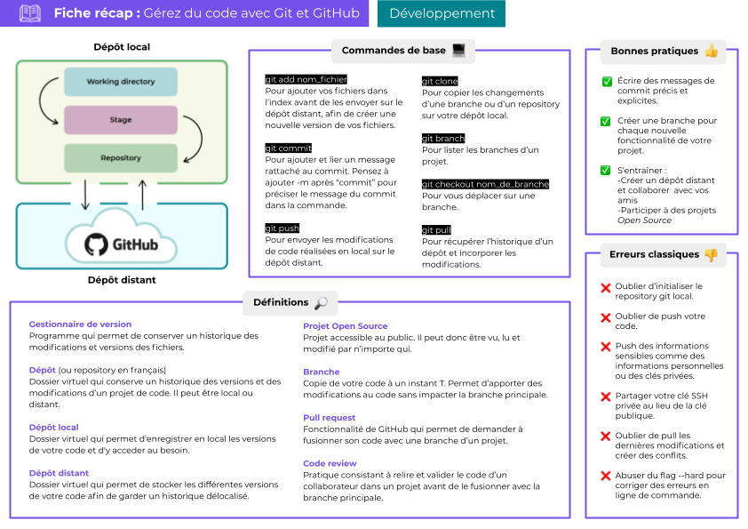

# Hands_on_Git_and_GitHub

Here I put my [learning notes in French](Git.md) of [Git and GitHub course](https://openclassrooms.com/fr/courses/7162856-gerez-du-code-avec-git-et-github) by OpenClassrooms. 

Feel free to check out this course by clicking the link !

